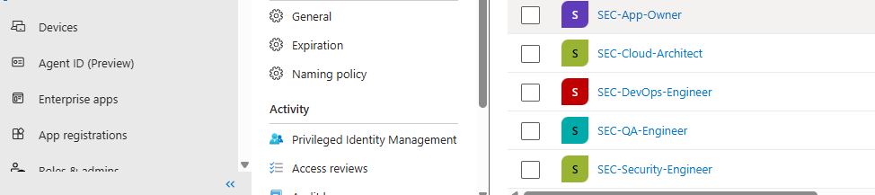
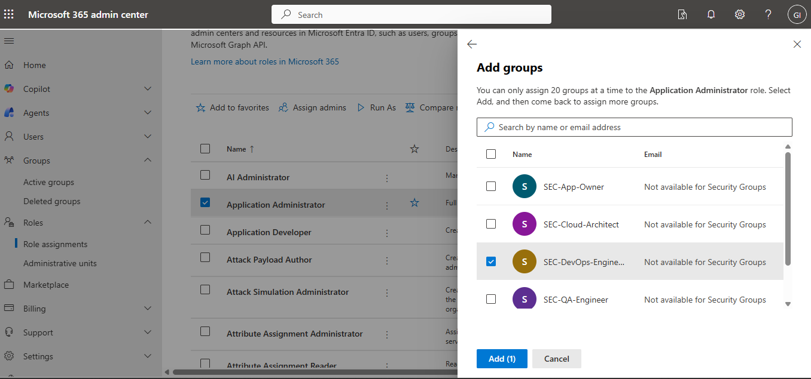
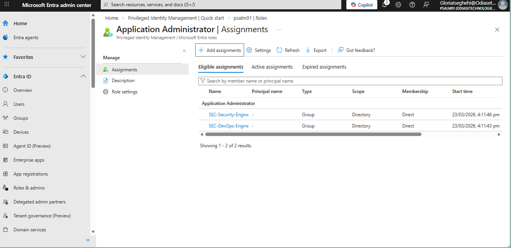
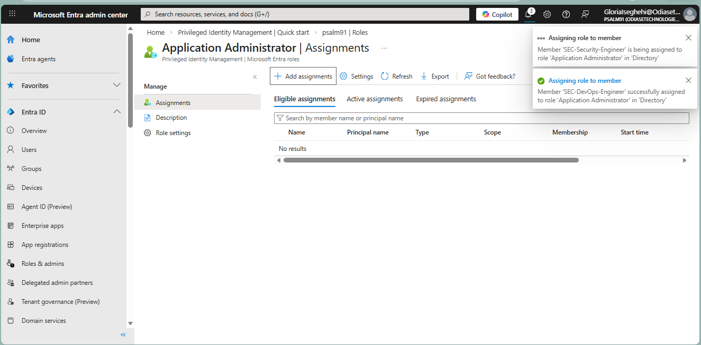

# ���️ Phase 2: RBAC Implementation & Group-Based Governance

This phase demonstrates the implementation of Role-Based Access Control (RBAC) using Microsoft Entra ID and Privileged Identity Management (PIM) to enforce least privilege and scalable access control.

---

## **Objective**

To transition the environment from individual, "standing" administrative assignments to a scalable **Group-Based RBAC model**. This ensures that permissions are tied to job functions rather than specific users, facilitating easier auditing and offboarding.

---

## **Step 1: Identity Governance (Security Groups)**

Before assigning roles, I established a structured identity hierarchy. I created specialized Security Groups to act as "containers" for specific engineering and security functions.

* **Group Created:** Sec-DevOps-Engineers
** Sec-DevOps-Engineers
** Sec-Cloud-Architect-Engineers
** Sec-QA-Engineers
** Sec-Security-Engineers
** Sec-App-Owners-Engineers
* **Purpose:** To aggregate all users requiring application management capabilities

#### **📸 Screenshot: Security Groups**

>Screenshot of the Groups > All groups page showing all the security groups created. 
> 
>
> **Technical Note:** Using groups instead of individual assignments reduces "permission creep" and ensures that if a user leaves the team, removing them from the group automatically revokes their privileged access.

---

## **Step 2: User Enrollment**

Once the groups were established, I populated them with the authorized technical staff.

* **Action:** Assigned relevant users to the security group
* **Verification:** Confirmed that the "Member" count reflects the authorized team size

> #### **[INSERT SCREENSHOT 2 HERE]**
>
> *Screenshot of the **Group > Members** page showing users assigned to the DevOps group.*

---

## **Step 3: Role Mapping & Eligibility**

This is the core of the RBAC implementation. Instead of assigning permanent ("Active") roles, I mapped the **Application Administrator** role to the **Group** as an **Eligible** assignment using Privileged Identity Management (PIM).

* **Role Assigned:** Application Administrator
* **Assignment Type:** Eligible (Just-in-Time)
* **Target:** Sec-DevOps-Engineers Group

> #### **📸 Screenshot: Security Groups**
>
>
>
> *Screenshot of the **PIM > Microsoft Entra roles > Assignments** page showing the Application Administrator role assigned to the group with state set to Eligible.*

---

## **Security Analysis: RBAC Security Benefits**

By implementing RBAC using group-based assignments and PIM, the environment achieves the following security benefits:

1. **Scalability:** New engineers can be onboarded by simply adding them to the appropriate group, automatically inheriting correct access policies.
2. **Least Privilege:** Users have no standing administrative privileges and must explicitly request access when needed.
3. **Auditability:** All privileged actions are traceable through group-based governance and PIM logs, simplifying compliance reviews.

**Real-World Scenario:**
If a DevOps engineer exits the organization, removing them from the Sec-DevOps-Engineers group immediately revokes all privileged access without requiring manual role audits.

---

## **Tools & Services Used**

* Microsoft Entra ID (Azure Active Directory)
* Privileged Identity Management (PIM)
* Azure Portal

---

## **Next Steps**

With the RBAC foundation in place, the next phase documents the **PIM Activation Workflow**, including:

* Multi-Factor Authentication (MFA) enforcement
* Just-in-Time (JIT) access request
* Approval workflow (if configured)
* Time-bound access (e.g., 4-hour activation window)

---

